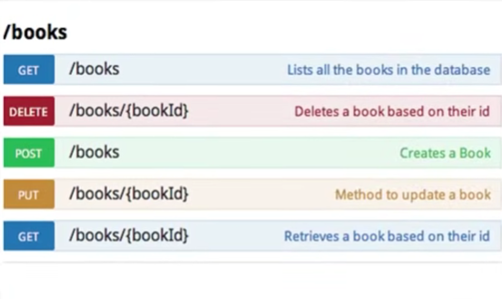
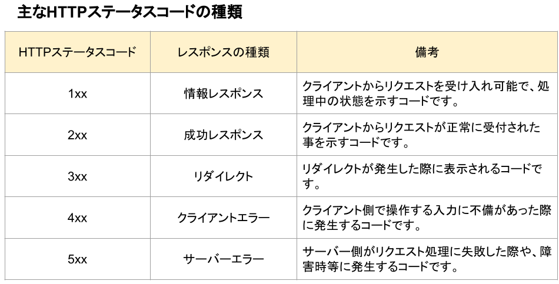

# FastAPI (Python ウエブフレームワーク)学習

プロジェクトでFastAPIを使うので、FastAPIの基礎を抑えたいと思います。
簡単なプロジェクトを作成し、FastAPIの基礎を学んでいきます。

---

Fast APIとは？

FastAPI - Fast Application Programming Interface

- バックエンドフレームワーク

エンドポイント

- アクセス制限のルート
- 自分でAPIデザインを考える

クエリパラメーター

- タイプのデータの情報取得や絞り込み（フィルタイング）用の追加情報
- ?の後に来る

リクエスト・リスポンス

リクエスト

- メソッド
- パス
- ボデイ
- ヘッダー

リスポンス

- ステータスコード
- ヘッダー
- ボデイ

                リスポンス到着

  フロントエンド ← バックエンド・APIサーバ
  クライアント・ウエブサイト　→　
  リクエスト送信

バックエンド・APIサーバー

- セキュリティレイヤー
- データに関するもの（取得、更新など）はバックエンドでやり取りしている。

リクエスト種類

- GET（取得）
- POST（登録）
- PUT（更新）
- DELETE（削除）

リクエスト・レスポンス例

ユーザーが投稿をこうしたい

リクエスト

- Type: PATCH
- Path: /api/post/45535
- ボデイ

リクエスト

- Status Code: 204
- ボデイ
  正常にデータ更新

---
